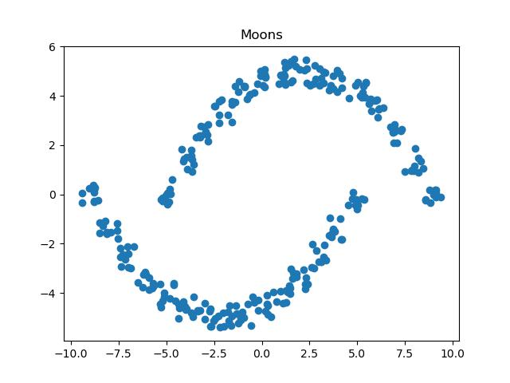

# uname01

## Tensor Class with Automatic Differentiation

N-Dimensional tensor with automatic differentiation. Performs flexible batched matrix multiplication using broadcasting with **`Tensor::matmul()`** method. 

Value class constructs computational graph while performing arithmetic operations. Upon **`.backward()`** call traverses graph backwards performing chain rule to calculate gradients.

```c++
  #include "tensor.hpp"
  #include "iostream"
  
  void main() {

    std::vector<unsigned int> dims1{5, 2, 4};
	Tensor a = Tensor::rand(dims1);

	std::vector<unsigned int> dims2{4, 2};
	Tensor b = Tensor::rand(dims2);

	Tensor* c = Tensor::matmul(a, b);
	std::cout << c->dims[0] << "x" << c->dims[1] << "x" << c->dims[2] << "\n" << std::endl;

	Value* r = c->sum();
	r->backward();
	std::cout << a[0]->grad<< std::endl;
  }
```

```bash
  5x2x2

  1.06317
```
## nn Class

Basic nn implementation, used below to distinguish betwen points belonging to spacially distinct groups.



```c++
#include <nn.hpp>
#include <iostream>
#include <util.hpp>
#include <random>
#include <cmath>

Value* loss(unsigned int bs, moons& data, nn& model) {

  float accuracy = 0;
	
  std::random_device rd; 
  std::mt19937 gen(rd());
  std::uniform_int_distribution<> distr(0, data.pts.size()-1); // random sampler 

  std::vector<unsigned int> dims{bs, 1, 2};
  Tensor* it = new Tensor(dims); // input tensor
  std::vector<int> indeces;

  for (int i = 0; i < bs; i++) {

	int index = distr(gen); // get random index
	it->ddata[i * 2] = new Value(&data.pts[index].first); // get data
	it->ddata[i * 2 + 1] = new Value(&data.pts[index].second);
	indeces.push_back(index); // store index
  }
	
  Tensor* preds = model(*it);

  float zero = 0;
  Value* lvp = new Value(&zero);

  for (int i = 0; i < bs; i++) {

	if (preds->operator[](i)->val * data.clr[indeces[i]] > 0) { // if prediction and actual are 
	  //							       of same sign
	  accuracy += 1;
	}

	lvp = *lvp + *(*(*(*(*preds->operator[](i) * data.clr[indeces[i]]) * -1.0F) + 1)->relu() / bs);
	// max-margin loss
  }
  
  accuracy /= bs;

  std::cout << "Loss: " << lvp->val << " Accuracy: " << floor(accuracy * 100) << std::endl;
  return lvp;
}


int main() {

  moons data = makemoons();
  std::cout << "got data of size: " << data.pts.size() << std::endl;

  std::vector<int> dims{2, 16, 1};

  nn nnn = nn(dims);

  for (int i = 0; i < 10; i++) {

	float lr = 0.01/pow(2, i);
	Value* l = loss(30, data, nnn);
	l->backward();
	nnn._backward(lr);

  }
}
```

```bash
got data of size: 300

Loss: 13.3359 Accuracy: 23
Loss: 1.77507 Accuracy: 50
Loss: 0.535202 Accuracy: 90
Loss: 0.297753 Accuracy: 86
Loss: 0.491108 Accuracy: 90
Loss: 1.94688 Accuracy: 76
Loss: 0.731771 Accuracy: 90
Loss: 1.11306 Accuracy: 83
Loss: 0.504233 Accuracy: 93
Loss: 0.0335175 Accuracy: 100
```
### Caveats

Batched matmul is only available for pairs of tensors wherein, for all batch dimensions, at least 1 tensor is of size 1 at that dimension. When called on tensors of different rank, matmul extends lower rank tensor to size of 1 in the approporiate dimensions until ranks match.

### What's next

Einstein summation notation, broadcasting for element-wise arithmetic operations on Tensor class.
